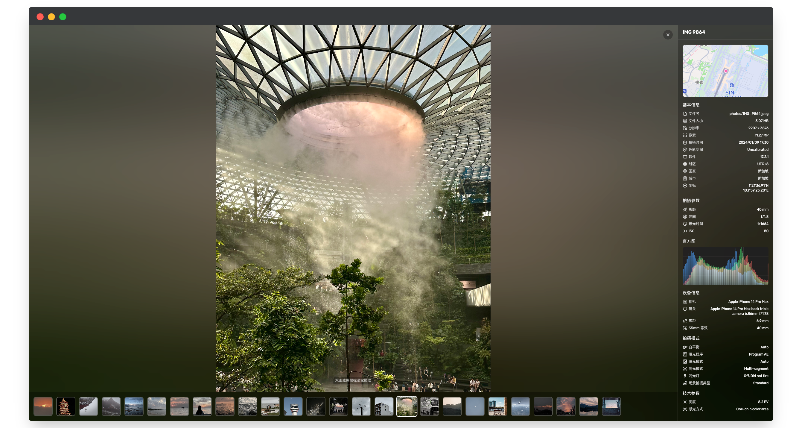
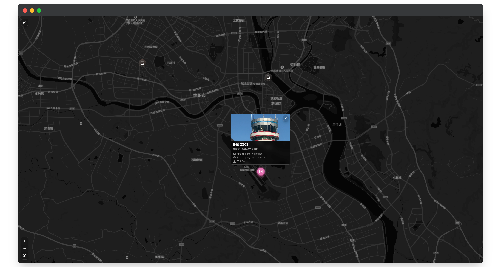
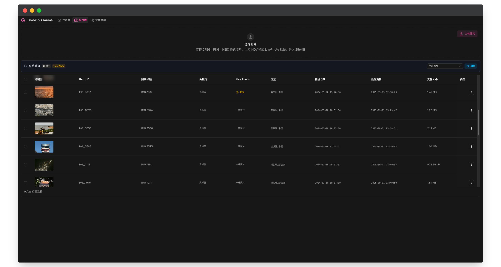

# PinPoint

<div align="center">
  
  <p>您的自托管照片库，珍藏美好回忆。</p>
  <p>基于 ChronoFrame 二次开发。</p>
</div>

## ✨ 简介

**PinPoint** 是一款自托管的个人照片库应用，旨在帮助您组织和展示珍贵的照片回忆。它支持自动提取 EXIF 信息、在交互式地图上展示拍摄位置，并提供美观的瀑布流布局。

> 本项目基于 [ChronoFrame](https://github.com/simonno3/chronoframe) 二次开发。

## 🚀 特性

- **瀑布流布局**：美观且响应式的照片展示
- **地图视图**：在地图上探索您的照片足迹
- **EXIF 解析**：自动提取并展示拍摄参数
- **S3 兼容**：支持各类 S3 兼容对象存储 (AWS, 腾讯云 COS, MinIO 等) 以及本地存储
- **多端展示**：智能生成缩略图，针对手机等小规模屏幕有针对性适配
- **动态排版**：完全自托管，数据掌握在自己手中

## ☁️ 部署指南

PinPoint 在架构设计上考虑了多样化的宿主环境，为您提供**两种互不冲突的部署方案**。您可以根据自己的服务器条件选择最适合的一种：

### 方案 A: Cloudflare (基于 NuxtHub) 🌟 推荐

这是 Serverless 时代的最佳实践，将项目部署到 Cloudflare 全球边缘节点上。**免服务器、免维护、速度快，且能充分利用 Cloudflare 的免费额度及 D1 数据库资源。**

#### 操作步骤：通过 GitHub Actions 自动部署

本项目内置了自动化工作流，你只需配置一次即可享受每次 Git Push 的自动发布：

1. **Fork 本代码库** 到你个人的 GitHub 账号下。
2. 登录 [NuxtHub Admin](https://admin.hub.nuxt.com/)，授权 GitHub 登录，并在面板中关联你刚刚 Fork 的项目，获取唯一的 `Project Key`。
3. 回到你 Fork 后的 GitHub 仓库，依次点击页面上方的 **Settings -> Secrets and variables -> Actions**。
4. 点击 **New repository secret**，名称填入 `NUXT_HUB_PROJECT_KEY`，内容填入刚刚获取的 Key。
5. （可选）如果你需要设置相关的环境变量，也可以在 Cloudflare 或 NuxtHub 后台中设置相应的 Environment Variables（参考下面的[环境变量配置](#-环境变量配置)）。
6. **大功告成！** 只要你的仓库里有新的代码合并到 `main` 分支，GitHub Actions 就会自动打包并将最新版部署到 Cloudflare 上。

*(注：如果你是开发者，也可以在本地 `clone` 后直接执行 `npx nuxthub deploy` 进行手动命令行发布)*

---

### 方案 B: Docker 自托管 (适用于 VPS, NAS 等)

如果您拥有自己的云服务器（VPS）或群晖/Nas 这类支持容器架构的设备，可以采用原汁原味的本地部署方案（使用内置 SQLite 和本地存储卷）。

考虑到部署极简原则，本项目也准备好了 Docker 端的 Action 预设配置。

#### 操作流程：使用容器构建发布

**方式 1：使用别人打包好的云端镜像（最简单）**
你可以直接使用 GitHub Container Registry (ghcr.io) 中的镜像启动拉取：

新建一个 `docker-compose.yml`：
```yaml
services:
  pinpoint:
    # 替换下面的 [用户名] 为 ghcr.io 上仓库所有者的名字，例如 nianshu2022
    image: ghcr.io/nianshu2022/pinpoint:latest
    container_name: pinpoint
    restart: unless-stopped
    ports:
      - '3000:3000'
    volumes:
      - ./data:/app/data   # 映射数据库（SQLite）和本地照片的持久化储存位置
    env_file:
      - .env
```
随后准备好环境变量文件 `.env`（见下节），执行 `docker-compose up -d` 即可。

**方式 2：自行编译构建镜像**
如果你克隆了代码到服务器：
```bash
docker build -t pinpoint .
docker run -d --name pinpoint -p 3000:3000 -v $(pwd)/data:/app/data --env-file .env pinpoint
```

## ⚙️ 环境变量配置

请在部署环境中（Docker 是 `.env` 文件，Cloudflare 是环境变量面板）提供以下配置值，下面提供的是**最小化配置要求**：

```bash
# ------------------ 必需配置 ------------------
# 会话密码（必须，强烈建议设置 32 位以上随机字符串，用于给 Session 加密）
NUXT_SESSION_PASSWORD=

# ------------------ 可选配置 ------------------
# 初代管理员邮箱和账户（首次启动初始化用）
CFRAME_ADMIN_EMAIL=admin@example.com
CFRAME_ADMIN_NAME=Admin
CFRAME_ADMIN_PASSWORD=your_password_here

# 地图提供器 (如果希望在地图上显示脚印，需配置以下二者之一)
# 选项: maplibre / mapbox
NUXT_PUBLIC_MAP_PROVIDER=maplibre
NUXT_PUBLIC_MAP_MAPLIBRE_TOKEN=
NUXT_PUBLIC_MAPBOX_ACCESS_TOKEN=
# Mapbox 无域名限制令牌（用于逆向地理编码）
NUXT_MAPBOX_ACCESS_TOKEN=

# 存储提供者（支持 local、s3）缺省为 local
NUXT_STORAGE_PROVIDER=local
# 当使用本地存储时：指定挂载存储位置
NUXT_PROVIDER_LOCAL_PATH=/app/data/storage
```

## 📖 使用指南

### 登录与上传

1. **登录控制台**：配置完毕后，如果未设定 Admin 变量，默认内置了管理员账号（邮箱: `admin@chronoframe.com`, 密码: `CF1234@!`）。请在右侧点击头像进入后台，并尽早修改自己的密码。
2. **上传照片**：访问仪表板 `/dashboard`。
3. 在 `Photos` 页面中选择图片点击上传，或直接拖拽文件进区域。
4. **智能处理**：系统将会自动帮你进行缩略生成、EXIF 提取（相机型号、光圈快门等）并去逆推反向所在地的字符串名！

### 支持的特殊格式
- 支持常规照片 (JPEG, PNG)。
- 兼容 Apple 等移动设备的 **HEIC / HEIF** 高效格式。
- （针对自托管版服务）若搭配传入正确的 `*.mov` 甚至可以触发解析为 Live Photo 实况照片展示！

## 📸 体验截图






## 🛠️ 开源参与与本地开发

### 环境要求

- Node.js 18+
- pnpm 10.0+

### 开发准备

```bash
# 克隆代码
git clone https://github.com/nianshu2022/PinPoint.git
cd PinPoint

# 安装依赖
pnpm install

# 配置开发环境变量 (如需)
cp .env.example .env

# 初始化数据库
pnpm db:generate

# 启动！
pnpm dev
```
应用将在 `http://localhost:3000` 呈现。

## ❓ FAQ

<details>
  <summary>如何创建/重置管理员用户？</summary>
  <p>首次启动项目时，读取到 <code>CFRAME_ADMIN_EMAIL</code> 和密码就会为你建立核心账户。后期可在此账号内管理更多用户。</p>
</details>

<details>
  <summary>目前存储机制是怎样的？</summary>
  <p>主要支持 S3 与 本地卷（Docker）。如果你使用 Cloudflare 部署并在意边缘流量/用量，可以考虑未来引入基于 C/S 架构的对象存储配置。</p>
</details>

<details>
  <summary>和原本的 ChronoFrame/Afilmory 等有何区别？</summary>
  <p>它是更加动态轻量化的 Web App，具备直连的动态数据增删改能力；特别针对 Cloudflare 的 D1 SQLite 和 Nuxthub 的无缝迁移做了深层构建处理。而典型的 Afilmory 多用于静态生成流部署方案。</p>
</details>

## 📄 许可证 & 赞赏

基于 [ChronoFrame](https://github.com/simonno3/chronoframe) 深加工的现代分支版本。
遵守与保留 [MIT 许可证](LICENSE) 开源。

**Github:** [@nianshu2022](https://github.com/nianshu2022)
